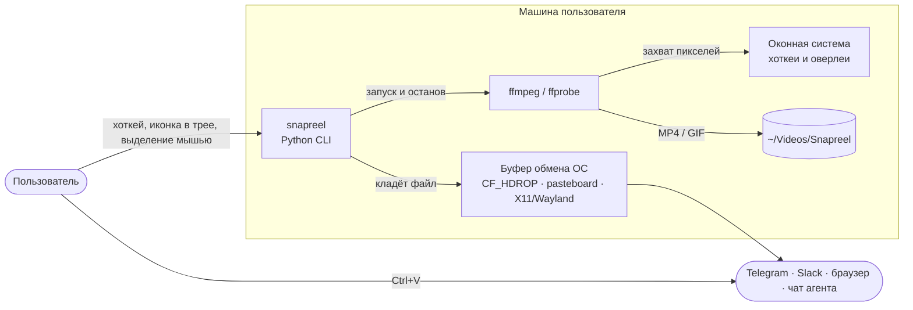
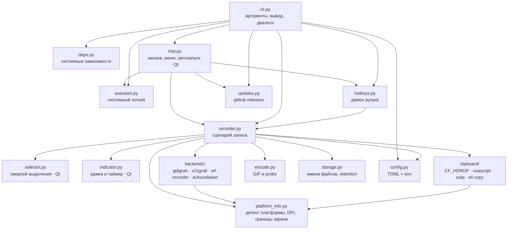
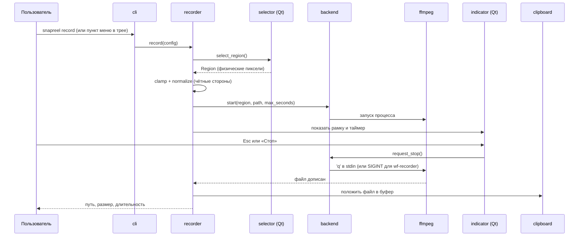
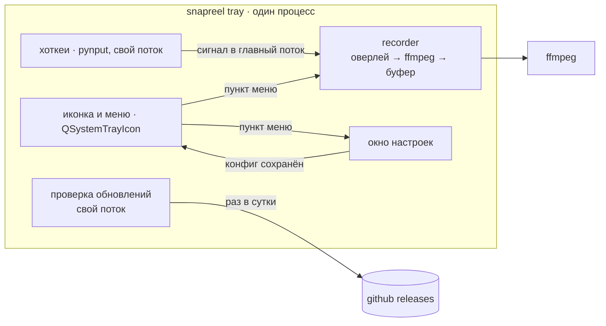

# Архитектура snapreel

snapreel — локальная настольная утилита без сервера и без сети. Пользователь
жмёт горячую клавишу или выбирает пункт в меню иконки рядом с часами, выделяет
мышью прямоугольник, snapreel пишет эту область в MP4 (или GIF) и кладёт
**файл** в буфер обмена. Сама запись — короткоживущий процесс Python, который
дирижирует внешним `ffmpeg` и системными утилитами буфера обмена; рядом с ним
может висеть второй, долгоживущий, — иконка в трее (ADR-0008).

## System context (C4 L1)

## Containers (C4 L2)

Контейнеров два, и оба — тот же самый исполняемый файл с разной подкомандой:
короткоживущий процесс записи и долгоживущий резидент с иконкой. Показаны их
модули и внешние исполняемые файлы, потому что именно на их границе живут все
сложности.

## Поток записи

## Трей и процессы

Иконка в трее — единственный долгоживущий процесс snapreel, и он же делает
всё остальное: цикл событий Qt один на приложение, и окна вкладываются в
него — настройки, установка, оверлей выделения, рамка записи. Наружу уходит
только `ffmpeg` (ADR-0010).

Раньше запись уходила отдельным процессом — так требовала пара pystray + Tk,
у которой два цикла событий не уживались в одном главном потоке. С Qt причина
исчезла, а цена осталась: запуск второго процесса (в релизе — распаковка
одиночного бинарника) стоил человеку секунд между нажатием комбинации и
появлением оверлея.

Работа из чужих потоков — хоткеи pynput и суточная проверка обновлений —
попадает в главный поток через сигналы `Bridge` с очередью: виджеты Qt чужой
поток трогать не вправе.

## Границы и правила

- **Платформенная развилка — только в двух местах**: выбор бэкенда захвата
  (`backends/__init__.py`) и выбор реализации буфера (`clipboard/__init__.py`).
  Оба спрашивают `platform_info.detect()`. Всё остальное платформо-независимо.
- **Ядро без побочных эффектов**: `region`, `config`, `storage`, `deps`,
  `autostart` — чистые функции и данные. Они и покрыты тестами плотнее всего.
- **Внешние процессы всегда за фасадом.** ffmpeg вызывается только из
  `backends/*` и `encode.py`; системные утилиты — только из `clipboard/*`,
  `autostart.py`, `deps.py`, `notify.py`. И запускаются все они через
  `proc.py`: на Windows консольный ребёнок оконного exe заводит себе чёрное
  окно, и снимает это единственный флаг.
- **GUI необязателен.** `selector`, `indicator` и `tray` подтягиваются лениво:
  без PySide6 работают `doctor`, `config`, `prune`, а запись — через
  `--region`.
- **Сеть — только у `updates`**, и только к github (ADR-0007). Раз в сутки её
  дёргает трей, по требованию — команда `update` и кнопка в настройках.

## Что где лежит

| Путь | Содержимое |
|---|---|
| `src/snapreel/` | пакет |
| `src/snapreel/backends/` | захват экрана, по файлу на платформу |
| `src/snapreel/clipboard/` | буфер обмена: `windows.py` (ctypes), `posix.py` (macOS + Linux) |
| `src/snapreel/assets/` | иконка приложения: PNG для окон и трея, ICO для exe |
| `tests/` | pytest, без экрана и без ffmpeg |
| `scripts/` | установщики для чистой машины, sync-скрипт правил агентов |
| `docs/adr/` | принятые решения и их причины |

## Где будет больно

- **Wayland.** Поддержан только wlroots (`wf-recorder`). GNOME и KDE со своими
  протоколами записи потребуют отдельного бэкенда через xdg-desktop-portal
  и PipeWire — это самая крупная известная дыра.
- **Мультимонитор на macOS.** avfoundation снимает один экран; область,
  пересекающая границу дисплеев, обрежется.
- **Трей в GNOME под Wayland.** Иконка появится только с расширением
  AppIndicator; Qt о неудаче не говорит, поэтому трей сам спрашивает
  `QSystemTrayIcon.isSystemTrayAvailable` и объясняет отсутствие человеку.
- **Буфер обмена в X11** держится процессом `xclip`; если пользователь убьёт
  его, вставка перестанет работать до следующей записи.
