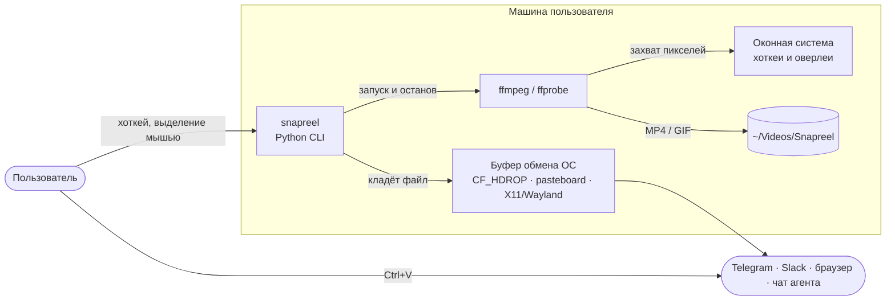
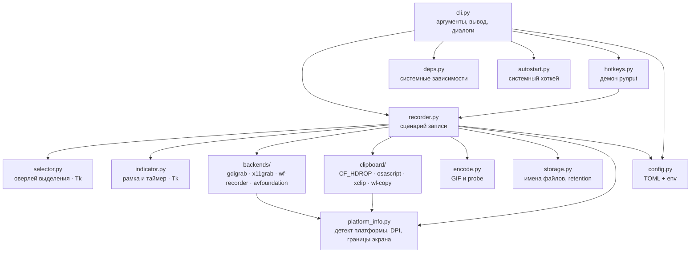
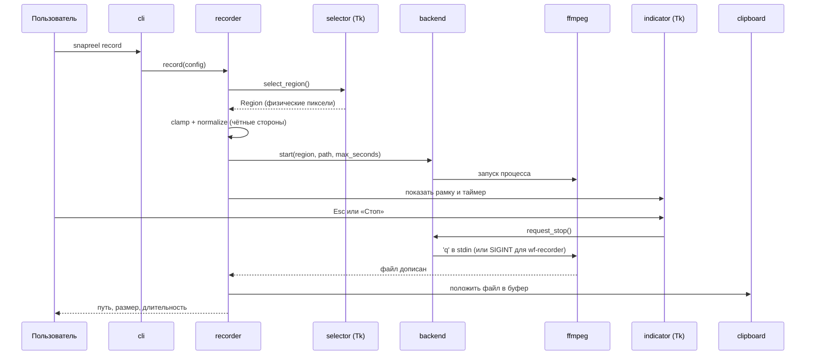

# Архитектура snapreel

snapreel — локальная настольная утилита без сервера и без сети. Пользователь
жмёт горячую клавишу, выделяет мышью прямоугольник, snapreel пишет эту область
в MP4 (или GIF) и кладёт **файл** в буфер обмена. Всё исполнение — один
короткоживущий процесс Python, который дирижирует внешним `ffmpeg` и
системными утилитами буфера обмена.

## System context (C4 L1)

## Containers (C4 L2)

Контейнер здесь ровно один — CLI-процесс. Показаны его модули и внешние
исполняемые файлы, потому что именно на их границе живут все сложности.

## Поток записи

## Границы и правила

- **Платформенная развилка — только в двух местах**: выбор бэкенда захвата
  (`backends/__init__.py`) и выбор реализации буфера (`clipboard/__init__.py`).
  Оба спрашивают `platform_info.detect()`. Всё остальное платформо-независимо.
- **Ядро без побочных эффектов**: `region`, `config`, `storage`, `deps`,
  `autostart` — чистые функции и данные. Они и покрыты тестами плотнее всего.
- **Внешние процессы всегда за фасадом.** ffmpeg вызывается только из
  `backends/*` и `encode.py`; системные утилиты — только из `clipboard/*`,
  `autostart.py`, `deps.py`, `notify.py`.
- **GUI необязателен.** `selector` и `indicator` подтягиваются лениво: без
  tkinter работают `doctor`, `config`, `prune`, а запись — через `--region`.

## Что где лежит

| Путь | Содержимое |
|---|---|
| `src/snapreel/` | пакет |
| `src/snapreel/backends/` | захват экрана, по файлу на платформу |
| `src/snapreel/clipboard/` | буфер обмена: `windows.py` (ctypes), `posix.py` (macOS + Linux) |
| `tests/` | pytest, без экрана и без ffmpeg |
| `scripts/` | установщики для чистой машины, sync-скрипт правил агентов |
| `docs/adr/` | принятые решения и их причины |

## Где будет больно

- **Wayland.** Поддержан только wlroots (`wf-recorder`). GNOME и KDE со своими
  протоколами записи потребуют отдельного бэкенда через xdg-desktop-portal
  и PipeWire — это самая крупная известная дыра.
- **Мультимонитор на macOS.** avfoundation снимает один экран; область,
  пересекающая границу дисплеев, обрежется.
- **Буфер обмена в X11** держится процессом `xclip`; если пользователь убьёт
  его, вставка перестанет работать до следующей записи.
